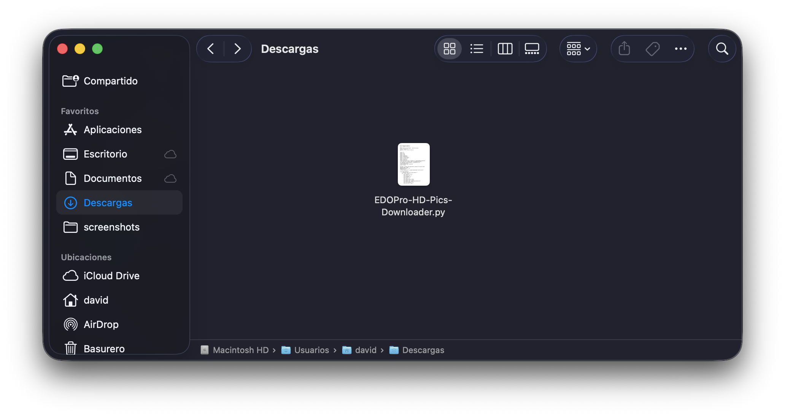
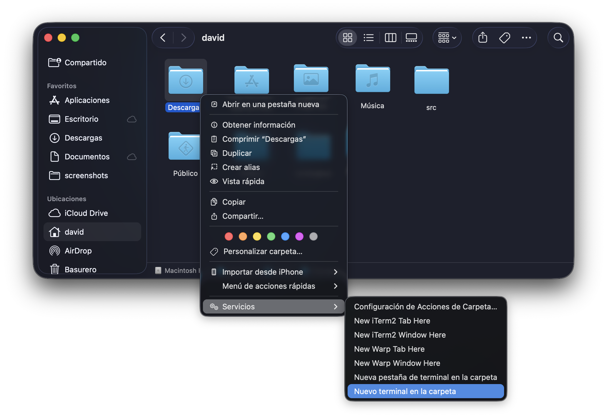
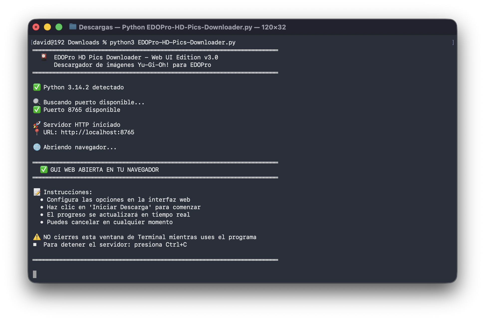
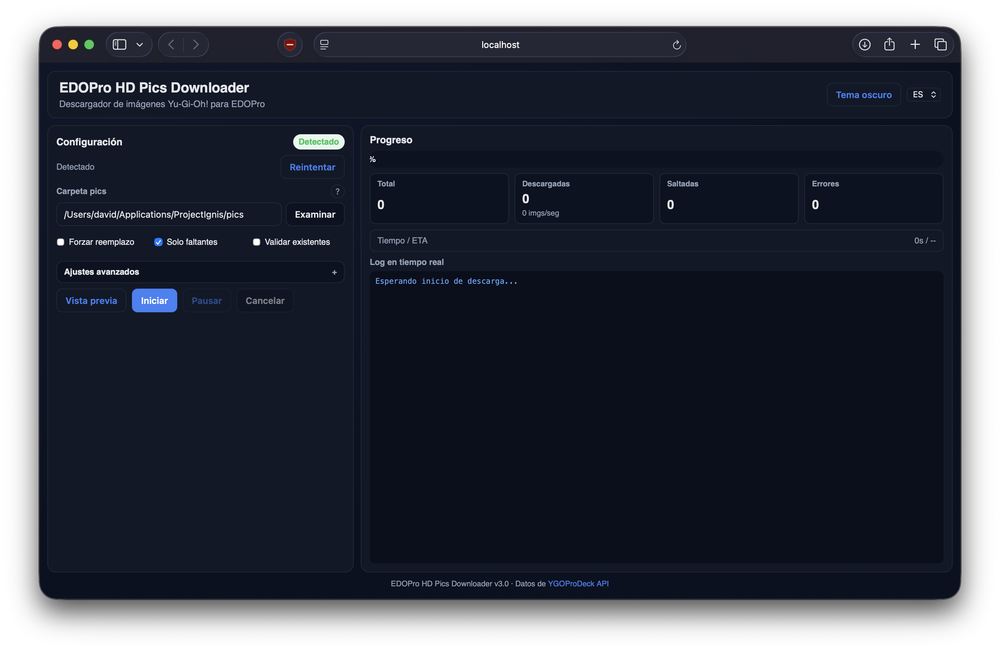
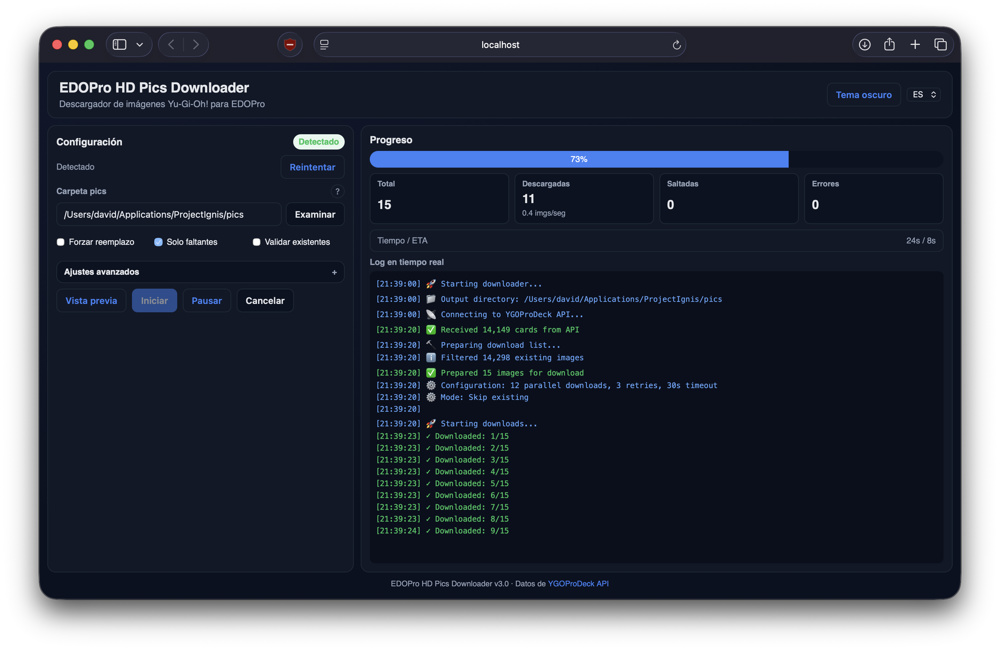
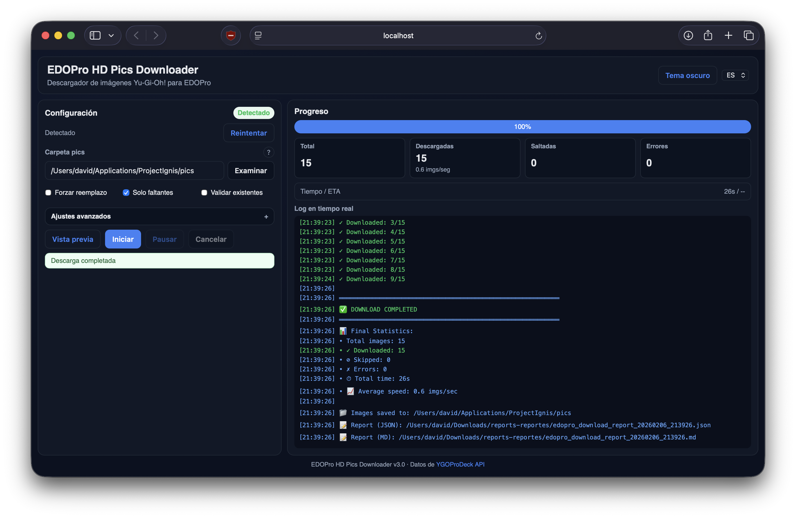
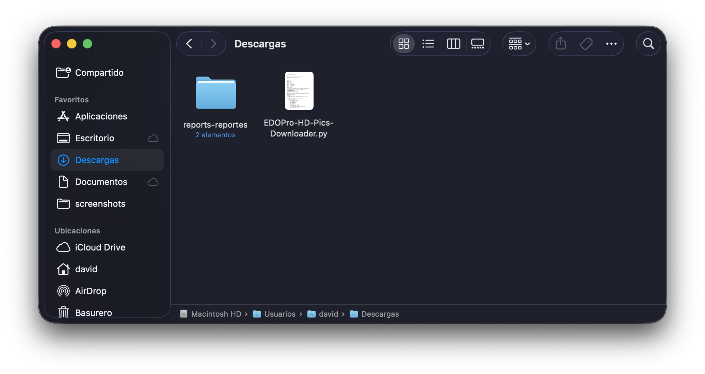

# EDOPro HD Pics Downloader — Python Options and Usage

[Leer en Español](OPTIONS_ES.md)

[Don’t have Python installed?](PYTHON_INSTALL.md)

## Step-by-step (Python)
1. Download the script file.
   
2. Open a Terminal in the folder where the script is.
   
3. Run the script with Python.
   
4. Wait for the UI to open in your browser.
   
5. (Optional) Use **Preview**, then click **Start**.
   
6. When it finishes, you’ll see the final status.
   
7. Reports are saved next to the script.
   

## Options
- **Pics folder**: exact path to ProjectIgnis/EDOPro `pics`.
- **Force overwrite**: re-download everything.
- **Only missing**: download only files not present.
- **Validate existing**: re-download corrupted images.
- **Concurrency**: parallel downloads.
- **Retries**: attempts per image.
- **Timeout (s)**: per-image timeout.
- **Max KB/s**: per-download rate limit (0 = unlimited).
- **Type filter**: filter by card type (e.g., `Spell`, `Monster`, `Trap`).
- **Set filter**: filter by set name/code (e.g., `LOB (Legend of Blue Eyes White Dragon)`, `SDY (Starter Deck: Yugi)`).

## Buttons
- **Preview**: show how many images will be downloaded.
- **Start**: begin download.
- **Pause/Resume**: pause without cancel.
- **Cancel**: stop the download.

## Reports
Saved next to the script in `reports-reportes/`:
- `edopro_download_report_YYYYMMDD_HHMMSS.json`
- `edopro_download_report_YYYYMMDD_HHMMSS.md`
